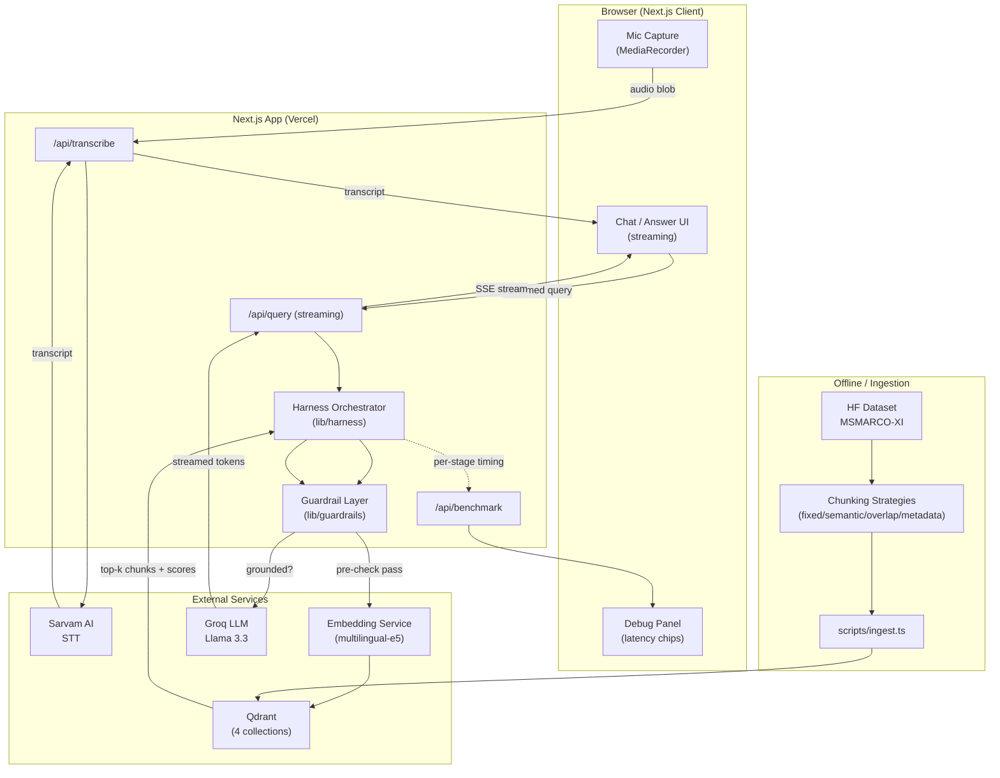

# 3. System Architecture Document

## 3.1 High-Level Architecture

## 3.2 Component Responsibilities
| Component | Responsibility |
|---|---|
| `MediaRecorder` client | Captures mic audio as webm/opus, chunks it, POSTs to `/api/transcribe` |
| `/api/transcribe` | Thin proxy to Sarvam (keeps API key server-side), returns transcript + STT latency |
| `/api/query` | Entry point for the RAG flow; SSE/streaming response |
| Harness Orchestrator | Sequences embed→retrieve→rerank→guardrail→generate with timeouts/retries (doc 09) |
| Guardrail Layer | Pre-check (off-topic/unsafe) and post-check (groundedness) (doc 10) |
| Qdrant (4 collections) | One collection per chunking strategy; queried in parallel, results merged |
| Groq LLM | Final answer generation, streamed |
| `/api/benchmark` | Aggregates logged per-request latencies into P50/P70/P100 |

## 3.3 Deployment Topology
- Next.js app → Vercel (Edge/Node runtime split: STT proxy + LLM call on Node runtime for SDK compatibility; static UI on Edge/CDN).
- Qdrant → Qdrant Cloud (always-on cluster, avoids cold-start latency that a serverless vector DB would add).
- Sarvam + Groq → called server-side only, keys never exposed to client.

## 3.4 Data Flow Ownership
- **Ingestion (offline, run once / on dataset update):** `scripts/ingest.ts` — see doc 05/06.
- **Online (per request):** everything in §3.1's `Edge` subgraph, fully synchronous within one HTTP request except the token stream.
