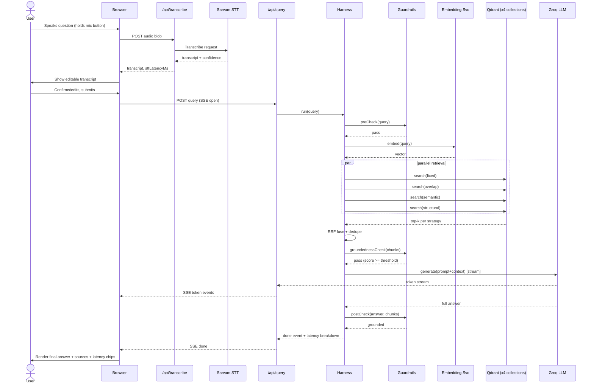
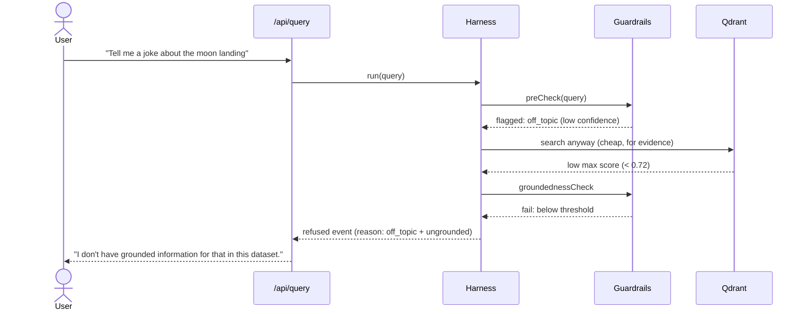
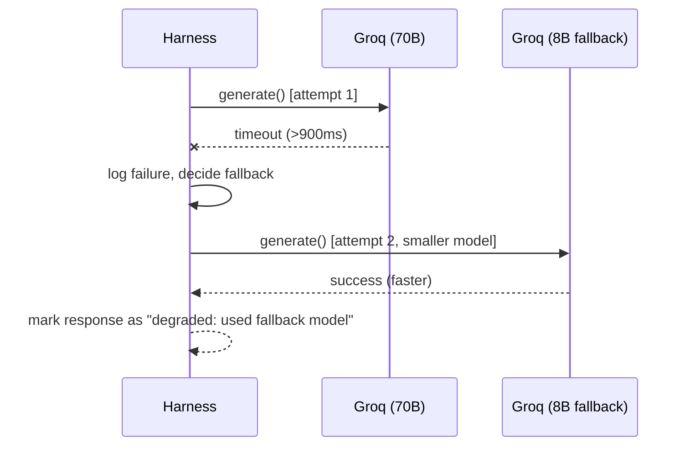

# 8. Sequence Diagrams

## 8.1 Full Voice-to-Answer Flow (happy path)

```mermaid
sequenceDiagram
    actor U as User
    participant B as Browser
    participant T as /api/transcribe
    participant S as Sarvam STT
    participant Q as /api/query
    participant H as Harness
    participant G as Guardrails
    participant E as Embedding Svc
    participant V as Qdrant (x4 collections)
    participant L as Groq LLM

    U->>B: Speaks question (holds mic button)
    B->>T: POST audio blob
    T->>S: Transcribe request
    S-->>T: transcript + confidence
    T-->>B: transcript, sttLatencyMs
    B->>U: Show editable transcript
    U->>B: Confirms/edits, submits
    B->>Q: POST query (SSE open)
    Q->>H: run(query)
    H->>G: preCheck(query)
    G-->>H: pass
    H->>E: embed(query)
    E-->>H: vector
    par parallel retrieval
        H->>V: search(fixed)
        H->>V: search(overlap)
        H->>V: search(semantic)
        H->>V: search(structural)
    end
    V-->>H: top-k per strategy
    H->>H: RRF fuse + dedupe
    H->>G: groundednessCheck(chunks)
    G-->>H: pass (score >= threshold)
    H->>L: generate(prompt+context) [stream]
    L-->>Q: token stream
    Q-->>B: SSE token events
    L-->>H: full answer
    H->>G: postCheck(answer, chunks)
    G-->>H: grounded
    H-->>Q: done event + latency breakdown
    Q-->>B: SSE done
    B->>U: Render final answer + sources + latency chips
```

## 8.2 Refusal Path (ungrounded / off-topic)

```mermaid
sequenceDiagram
    actor U as User
    participant Q as /api/query
    participant H as Harness
    participant G as Guardrails
    participant V as Qdrant

    U->>Q: "Tell me a joke about the moon landing"
    Q->>H: run(query)
    H->>G: preCheck(query)
    G-->>H: flagged: off_topic (low confidence)
    H->>V: search anyway (cheap, for evidence)
    V-->>H: low max score (< 0.72)
    H->>G: groundednessCheck
    G-->>H: fail: below threshold
    H-->>Q: refused event (reason: off_topic + ungrounded)
    Q-->>U: "I don't have grounded information for that in this dataset."
```

## 8.3 Failure + Retry Path

```mermaid
sequenceDiagram
    participant H as Harness
    participant L as Groq (70B)
    participant L2 as Groq (8B fallback)

    H->>L: generate() [attempt 1]
    L--xH: timeout (>900ms)
    H->>H: log failure, decide fallback
    H->>L2: generate() [attempt 2, smaller model]
    L2-->>H: success (faster)
    H-->>H: mark response as "degraded: used fallback model"
```
