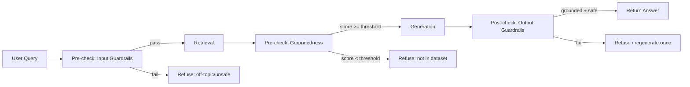

# 10. Guardrails Design

## 10.1 Layers

## 10.2 Input Guardrails (pre-retrieval)
1. **Empty/garbage transcript filter** — length/entropy check on STT output (catches silence, noise-only clips).
2. **Off-topic classifier** — lightweight: embed the query, compare centroid similarity to the dataset's topic embedding centroid(s); below-threshold → likely off-topic. Backed up by a cheap keyword/domain heuristic list.
3. **Unsafe-input classifier** — a small prompt to the LLM itself (fast 8B call, or a keyword/category classifier) checking for self-harm, violence, illegal-activity requests, PII harvesting attempts, prompt-injection patterns ("ignore previous instructions", etc.). Runs in parallel with embedding to not add latency.
4. **Prompt-injection sanitization** — transcript is never concatenated raw into the system prompt; it's inserted into a clearly delimited `<user_query>` block, and the system prompt explicitly instructs the model to treat content inside retrieved context/query as data, not instructions.

## 10.3 Groundedness Guardrail (pre-generation)
- Compute max cosine similarity across fused retrieval results.
- Threshold (tunable, start at `0.72`): below → refuse immediately, **skip the LLM call entirely** (saves latency + avoids hallucination risk).
- This is the primary defense against "confidently answering from parametric knowledge instead of the dataset."

## 10.4 Output Guardrails (post-generation)
1. **Citation-presence check** — does the answer reference at least one retrieved passage (by inline marker like `[1]`, or by lexical overlap ≥ threshold)? If not → treat as ungrounded.
2. **Hallucination heuristic** — flag numeric claims, dates, or named entities in the answer that don't appear anywhere in the retrieved context; if flagged, either regenerate once with a stricter "only use provided context" instruction, or append a visible "low-confidence" badge.
3. **Refusal-language check** — if context was insufficient, confirm the model actually said so rather than guessing (regex/semantic check for expected refusal phrasing when `groundedness == false` was already known).
4. **Safety re-check on output** — a final pass on the *generated* text (not just input) since the model could still produce something inappropriate even from safe context.

## 10.5 Refusal UX
Refusals are never a bare error — they render as a normal assistant message:
> "I couldn't find grounded information about that in this dataset, so I don't want to guess. Try rephrasing, or ask about [topic areas the dataset covers]."

This satisfies "guardrails that know when *not* to answer" as a visible product behavior, not just a backend log line.

## 10.6 What we explicitly log (for the demo + submission)
- Every refusal event, with reason code, is retained in the trace store — the benchmark report (doc 18) includes a refusal-rate metric, giving judges concrete evidence guardrails actually fire (not just exist in code).
